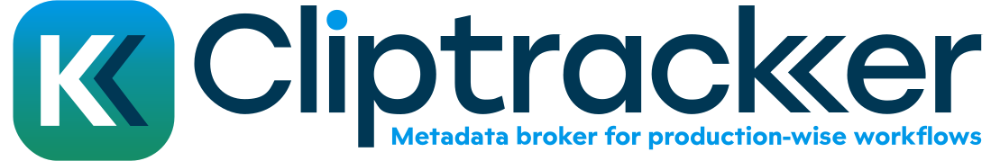

# ClipTracker




## Description

ClipTracker is a metadata broker that facilitates the transformation of specially formatted ALE (Avid Log Exchange) files into precisely structured XML files for use with Telestream Vantage workflows. These generated XML files are designed to be sidecar files accompanying native media files. The application provides a web interface for uploading, analyzing, and processing ALE files, alongside a system tray icon for quick access.

## Features

- **Metadata Analysis**: Load ALE files to extract detailed information and detect errors.
- **XML Conversion**: Generate structured XML files tailored for Vantage from the provided ALE data.
- **Web Interface**: Accessible through a local web browser for intuitive file management.
- **System Tray Integration**: Launches in the background with a system tray icon for quick interactions.
- The duration of the rushes to be processed is displayed, along with a simulation of the processing time required in Vantage. By default, a "Realtime factor" of 10 is applied, but after the first analysis, an `rtfactor.conf` file is created next to the executable, allowing you to adjust this factor to match your workflow.

## Prerequisites

- A pre-compiled executable (`cliptracker.exe`) available in the `dist` directory.
- An environment with Telestream Vantage for utilizing the generated XML files.

## Usage

1. Navigate to the `dist` directory.
2. Run the application:
   ```bash
   cliptracker.exe
   ```
3. Use the system tray icon to:
   - Open the web interface manually.
   - Exit the application.

### ALE Configuration for Avid Media Composer

To properly configure the "Bin View" in Avid Media Composer, ensure the following columns are used:

- `Name`
- `Start`
- `Esta`
- `Session`
- `End`
- `Ingestator`
- `Ingest_manuel`
- `Duration`
- `Tape`
- `Source File`
- `Source Path`

## Test File

A sample ALE file is provided (`dist/test.ALE`) for testing purposes. Use it to explore the application's features and validate the workflow.

## Contribution

Contributions are welcome! Please submit pull requests with clear descriptions of your changes.

## License

This project is licensed under the GPL-3.0 License. This license allows users to run, study, share, and modify the software while ensuring that all derivatives remain under the same license. For full details, see the `LICENSE` file.&#x20;
